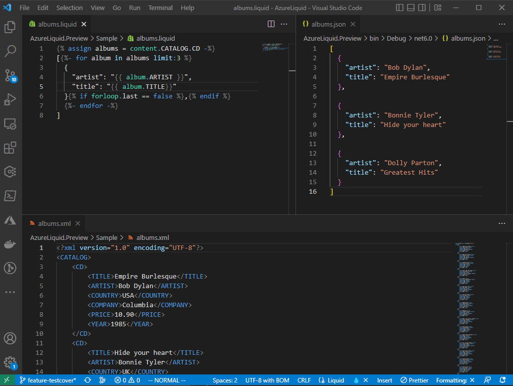

# Azure Liquid

 Allows programmatic parsing, unit testing and live preview of Liquid templates, specifically designed for the Azure cloud services.

[](https://github.com/lekman/AzureLiquid/actions/workflows/ci_unit_tests.yml)
[](https://github.com/lekman/Liquid.Parser/actions/workflows/codeql.yml)
[](https://www.nuget.org/packages/azureliquid)

## Overview

The project was primarily built to aid in developing and testing Liquid template parsing solutions for Microsoft Azure cloud services.

The Liquid template engine that is used in Microsoft Azure is based on the [DotLiquid](https://github.com/dotliquid/dotliquid) library.

>DotLiquid is a .Net port of the popular Ruby Liquid templating language. It is a separate project that aims to retain the same template syntax as the original, while using .NET coding conventions where possible. For more information about the original Liquid project, see https://shopify.github.io/liquid/.

This library uses my [.NET 6.0 port](https://github.com/lekman/dotliquid-net6) of the same library, to allow for cross-platform compilation and tooling support.

## Azure Specific Implementations

For example, an Azure LogicApp mapping service uses the content accessor. The LiquidParser exposes a set of SetContent methods used to either set:

- objects (will render down to JSON)
- JSON string
- XML string (will parse as XDocument then to JSON)

The object can then be accessed under the 'content' variable in the Liquid template. This is implemented by using the LiquidParser object and using it for unit testing or for live previews/file rendering.

## Learning the Basics of Liquid Templates and DotLiquid

TODO

## How To Unit Test Liquid

There are a few different examples made:

```csharp
// Arrange
var myObj = new MyObj( Title = "Title here");

// Act
var result = new LiquidParser()
    .SetContent(myObj, true) // 'true' => camelCase property names
    .Parse("{{ content.title }}")
    .Render();

// Assert
result.Should().NotBeEmpty("A result should have been returned");
result.Should().Be(myObj.Title, "The expected result should be returned");
```

[See the full example](https://github.com/lekman/Liquid.Parser/blob/main/Liquid.Tests/LiquidParserTests.cs#L22)

Another example can be made where we use a string body to transform the data.

```csharp
/// <summary>
/// Ensures loading JSON from a file and parsing with a liquid file template works.
/// </summary>
[Fact]
public void EnsureJsonBodyTemplateParsing()
{
    // Arrange
    var parser = new LiquidParser()
        .SetContentJson(Resources.JsonTestContent)
        .Parse(Resources.JsonTestLiquidTemplate)
    var expected = Resources.TestExpectedOutput;

    // Act
    var result = parser.Render();

    // Assert
    result.Should().NotBeEmpty("A result should have been returned");
    result.Should().Be(expected, "The expected result should be returned");
}
```
You could similarly load the content and templates from a set of file. See the [full test project](https://github.com/lekman/Liquid.Parser/tree/main/Liquid.Tests) for several such examples.

## Enabling Live Preview During Development

Using the Live Preview console application, we can set a file watcher that automatically renders the output as any changes occur to the source data or Liquid template.

For now, the process is started from the terminal using a set of arguments.

| Argument   | Description                                                               |
|------------|---------------------------------------------------------------------------|
| --help     | Shows help description within the console                                 |
| --watch    | Switch parameter to enable file watcher and produce output on file update |
| --template | Relative path to the .liquid template source file                         |
| --content  | Relative path to the XML or JSON data source file                         |
| --output   | Relative path to the output result file                                   |

For example:

```bash
AzureLiquidPreview --watch --content ./albums.xml --template ./albums.liquid --output ./albums.json
```

I have simply arranged the three files in VSCode and get preview on the right hand side whenever the template or XML source is changed.



Future changes that are planned:

- Nuget package with installer to create global console tool
- VSCode plugin that allows starting/stopping preview from the UI or from the command palette